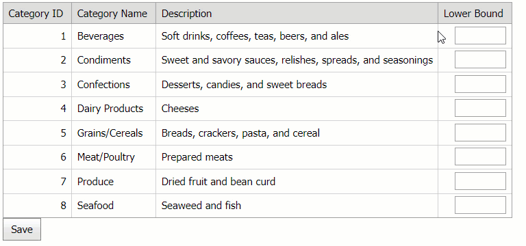

<!-- default badges list -->

<!-- default badges end -->
# Grid View for ASP.NET Web Forms - How to sort data based on user preferences
This example demonstrates how to allow users to sort data based on their preferences in the [Grid View](https://docs.devexpress.com/AspNet/5823/components/grid-view) control. 

In this example, the Grid View contains an unbound column that displays text boxes in data cells. Users can enter numbers in text boxes and sort grid data based on these numbers.

## Files to Review

* [Default.aspx](./CS/Default.aspx) (VB: [Default.aspx](./VB/Default.aspx))
* [Default.aspx.cs](./CS/Default.aspx.cs) (VB: [Default.aspx.vb](./VB/Default.aspx.vb))

## Documentation

- [Unbound Columns in Grid View](https://docs.devexpress.com/AspNet/3732/components/grid-view/concepts/data-representation-basics/columns/unbound-columns)
- [Grid View Examples](https://docs.devexpress.com/AspNet/3768/components/grid-view/examples)

## More Examples

- [How to calculate bound and unbound column values on the client](https://github.com/DevExpress-Examples/asp-net-web-forms-grid-calculate-bound-and-unbound-column-values)
